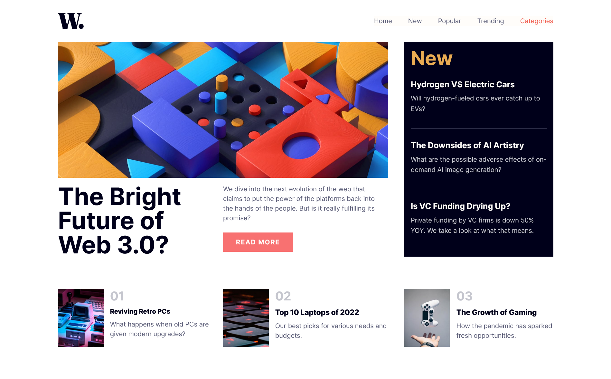

# Frontend Mentor - News homepage solution

This is a solution to the [News homepage challenge on Frontend Mentor](https://www.frontendmentor.io/challenges/news-homepage-H6SWTa1MFl).

## Welcome! 👋

### Screenshot

### Links

- Solution URL: [https://karimaoulallay.github.io/News_Homepage/]

## My process

### Built with

- Semantic HTML5 markup
- CSS custom properties
- Flexbox
- CSS Grid
- Mobile-first workflow
- TailwindCss

## Author

- Frontend Mentor - (https://www.frontendmentor.io/profile/karimode)
- Twitter - (https://twitter.com/karim_aoulallay)
